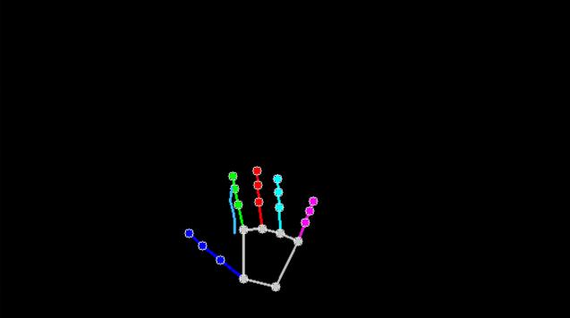
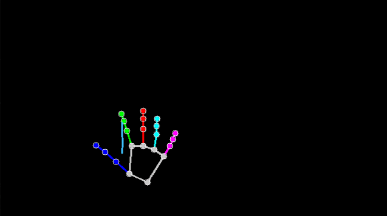
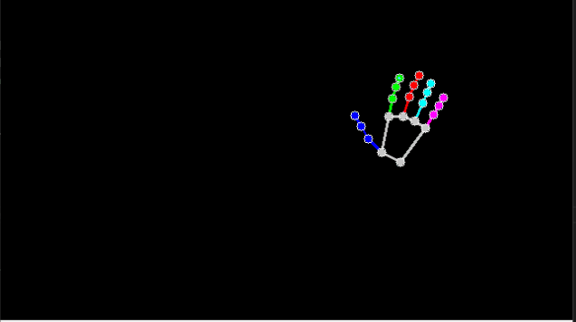
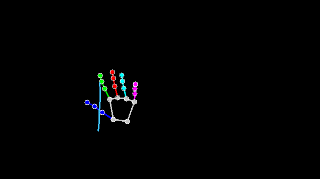
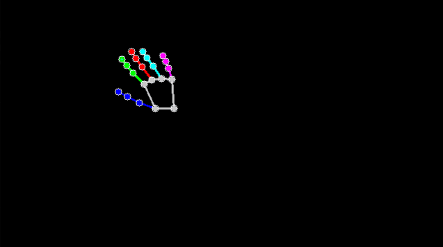
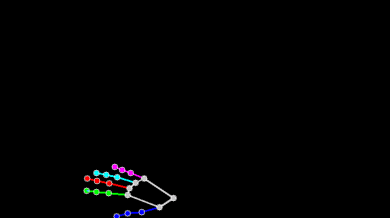
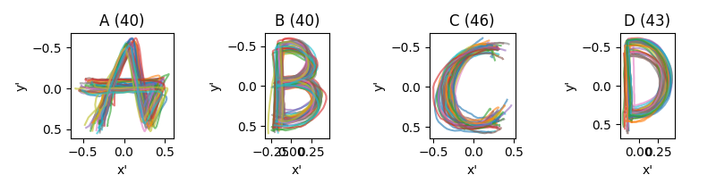

# GestureRecognitionMPT

<p align="center">
  
  
  
  
  
  
</p>

## Inhaltsverzeichnis

- [Prüfungsleistung](#prüfungsleistung)
  - [Aufgabenübersicht](#aufgabenübersicht)
    - [1. HandDetector & Preprocessor](#1-handdetector--preprocessor)
    - [2. Datenerfassung (Labeling)](#2-datenerfassung-labeling)
    - [3. Datenexploration & Visualisierung](#3-datenexploration--visualisierung)
    - [4. HMMClassifier (Training & Inferenz)](#4-hmmclassifier-training--inferenz)
    - [5. Live-Modus](#5-live-modus)
  - [Bewertungskriterien](#bewertungskriterien)
  - [Dokumentation](#dokumentation)
- [Implementierungshilfen](#implementierungshilfen)
  - [Erste Schritte](#erste-schritte)
  - [Grundlagen zum Framework](#grundlagen-zum-framework)
    - [SignalHub](#signalhub)
    - [Replay-Modus](#replay-modus)
    - [GALY (Graphical Abstraction Layer)](#galy-graphical-abstraction-layer)
    - [Pipeline verändern](#pipeline-verändern)
  - [Modules](#modules)
    - [HandDetector](#handdetector)
    - [TrailMarker](#trailmarker)
    - [Preprocessor](#preprocessor)
    - [HMMModule](#hmmmodule)
  - [Labeln & Klassen aufzeichnen](#labeln--klassen-aufzeichnen)
    - [data_labeling()](#data_labeling)
    - [dataset_building()](#dataset_building)
  - [Visualisierung ihres Datensatzes](#visualisierung-ihres-datensatzes)
    - [evaluate_classifier()](#evaluate_classifier)
    - [replay_recordings()](#replay_recordings)
    - [visualize_dataset()](#visualize_dataset)
  - [Fit/Train HMM Classifier](#fittrain-hmm-classifier)
    - [HMMClassifier](#hmmclassifier)

---

# Prüfungsleistung

In dieser Prüfung entwickeln Sie ein vollständiges System zur Erkennung von Handgesten auf Basis von Hidden Markov Models (HMM).

**Die Bewertung umfasst:**

- [Aufgabenübersicht](#aufgabenübersicht)
  1. HandDetector & Preprocessor
  2. Datenerfassung (Labeling)
  3. Datenexploration & Visualisierung
  4. HMMClassifier (Training & Inferenz)
  5. Live-Modus
- [Bewertungskriterien](#bewertungskriterien)
- [Dokumentation](#dokumentation)

Die einzelnen Komponenten sind aufeinander aufbauend konzipiert und entsprechend zu dokumentieren. Sie müssen in der Lage sein, sowohl das Gesamtsystem auf abstrakter Ebene als auch Ihren spezifischen Beitrag im Detail zu erläutern.

## Aufgabenübersicht

### 1. HandDetector & Preprocessor

Implementieren Sie Module zur:

- Erkennung von Händen und Landmarken
- Extraktion und Normalisierung von Fingertrajektorien

> [!NOTE]
> Diese Komponenten bilden die Grundlage für das gesamte System.

> [!WARNING]
> Ihr Preprocessing muss so gestaltet sein, dass es später vom HMM-Classifier sinnvoll verarbeitet werden kann. An diesem Schritt sollten am Anfang alle Teilnehmer sinnvoll beteiligt sein.

Implementierungshilfen: [Modules](#modules)

### 2. Datenerfassung (Labeling)

Erstellen Sie ein System zur Aufnahme von Trainingsdaten.

**Anforderungen:**

- Neue Gesten sollen aufgezeichnet werden können
- Daten müssen strukturiert gespeichert werden
- Mehrere Klassen (Labels) müssen unterstützt werden

**Erweiterung:**

- Es können auch Abstände zwischen den Fingern uvm. als Feature verwendet werden

> [!NOTE]
> In der Prüfung werden neue Daten **live vom Prüfer aufgenommen**. Ihr System muss darauf vorbereitet sein.

> [!TIP]
> Denken Sie über einen effizienten Workflow nach:
> - schnelle Aufnahme
> - einfaches Verwerfen schlechter Sequenzen
> - klare Datenorganisation

Implementierungshilfen: [Labeln & Klassen aufzeichnen](#labeln--klassen-aufzeichnen)

### 3. Datenexploration & Visualisierung

Sie müssen Ihren Datensatz analysieren und verstehen können.

**Beispiele:**

- Visualisierung von Trajektorien (z. B. als Plot)
- Vergleich mehrerer Sequenzen pro Klasse



*Beispielhafte Visualisierung eines Datensatzes mit mehreren Trajektorien pro Klasse.*

**Zusätzlich:**

- Darstellung der Modellperformance (z. B. Confusion Matrix)

> [!NOTE]
> Gute Modelle entstehen nur mit guten Daten.

> [!TIP]
> Nutzen Sie Visualisierung aktiv zum Debugging.

Implementierungshilfen: [Visualisierung ihres Datensatzes](#visualisierung-ihres-datensatzes)

### 4. HMMClassifier (Training & Inferenz)

Implementieren Sie einen eigenen Klassifikator basierend auf Hidden Markov Models.

**Anforderungen:**

- Trainieren Sie ein Modell pro Klasse
- Klassifizieren Sie Sequenzen anhand ihrer Wahrscheinlichkeit
- Wählen Sie die Klasse mit dem besten Score

> [!WARNING]
> Der Klassifikator muss selbst implementiert werden. Es reicht nicht, fertige Lösungen zu verwenden.

> [!TIP]
> Überlegen Sie:
> - Wie strukturieren Sie Ihre Trainingsdaten?
> - Wie vergleichen Sie Modelle?
> - Wie gehen Sie mit Sequenzlängen um?

**Erweiterung (optional):**

- Grid Search für Hyperparameter (z. B. Anzahl Zustände, Modellstruktur)
- Vergleich verschiedener Modellkonfigurationen

Implementierungshilfen: [Fit/Train HMM Classifier](#fittrain-hmm-classifier)

### 5. Live-Modus

Ihr System soll in der Lage sein:

- Live-Daten aufzunehmen
- Diese direkt zu verarbeiten
- Eine Geste in Echtzeit zu klassifizieren

> [!NOTE]
> Dies ist der finale Integrationstest Ihres Systems.

> [!WARNING]
> Alle Komponenten müssen hier zuverlässig zusammenspielen:
> - Detector
> - Preprocessor
> - Classifier

## Bewertungskriterien

Die Bewertung orientiert sich an folgenden Punkten:

- Funktionalität des Gesamtsystems
- Qualität und Struktur der Daten
- Verständlichkeit und Nachvollziehbarkeit
- Robustheit der Lösung
- Qualität der Modellperformance

> [!TIP]
> Eine sehr gute Lösung zeichnet sich dadurch aus, dass:
> - das System stabil läuft
> - die Daten sauber aufbereitet sind
> - die Ergebnisse nachvollziehbar erklärt werden können

> [!NOTE]
> Bonuspunkte können durch weiterführende Ansätze erzielt werden, wie z. B. Hyperparameter-Optimierung oder zusätzliche Analysen.

## Dokumentation

Sie müssen in der Lage sein, Ihr System zu erklären:

- Aufbau der Pipeline
- Entscheidungen im Design
- Interpretation der Ergebnisse

> [!WARNING]
> Die hier gezeigte Struktur sowie die konkrete Implementierung der Module stellen lediglich eine mögliche Referenz dar.
>
> Abweichende Ansätze sind ausdrücklich erlaubt und erwünscht, solange die funktionalen Anforderungen erfüllt werden. Eine identische Umsetzung ist nicht erforderlich.

---

# Implementierungshilfen

## Erste Schritte

Bevor Sie mit der Implementierung beginnen, müssen Sie das Projekt lokal einrichten.

**1. Repository klonen:**

> [!NOTE]
> Sie sollten mit Git und GitHub vertraut sein. Hier wird zu Demonstrationszwecken das original Repository geklont. Wenn sie Git als Version-Control-System verwenden, klonen sie selbstverständlich ihren Fork.

```bash
git clone https://github.com/jaboll-ai/GestureRecognitionMPT
cd GestureRecognitionMPT
```

**2. Abhängigkeiten installieren:**

```bash
pip install -r requirements.txt
```

> [!TIP]
> Falls Sie `uv` verwenden, können Sie die Umgebung auch automatisch verwalten:
> ```bash
> uv sync
> ```

**3. Download der Recording-Dateien**

Die bereitgestellten Daten finden Sie hier. Diese können Sie entweder im Browser oder über die Kommandozeile herunterladen:

```bash
wget https://github.com/jaboll-ai/GestureRecognitionMPT/releases/download/recordings-v1/recordings.zip
```

Entpacken Sie die `.7z`- oder `.zip`-Datei in Ihren geklonten Projektordner.

**4. Testlauf im Replay-Modus:**

```bash
python main.py --mode replay --recorder <path_to_recording>.pkl
```

Ersetzen Sie `<path_to_recording>` durch eine der bereitgestellten Recording-Dateien.

> [!NOTE]
> Der Replay-Modus ist der einfachste Einstiegspunkt, da er keine Webcam benötigt.

## Grundlagen zum Framework

Um effizient mit der Aufgabe arbeiten zu können, ist es wichtig, die grundlegenden Konzepte des bereitgestellten Frameworks zu verstehen.

> [!NOTE]
> Sie müssen das Framework nicht vollständig verstehen, um zu starten. Wichtiger ist:
> - Welche Daten bekommt mein Modul?
> - Welche Daten muss ich zurückgeben?

### SignalHub

`SignalHub` ist ein modulares Pipeline-System.

- Daten werden in Form von Signalen zwischen Modulen weitergegeben
- Jedes Modul verarbeitet eingehende Daten und erzeugt neue Signale
- Die Pipeline wird über die `config.yaml` definiert

Typische Signale für dieses Projekt sind z. B.:

- `webcam` → Rohbild der Kamera
- `detector` → erkannte Hand + Landmarken
- `preprocessor` → normalisierte Trajektorie

Ziel ist es, Module zu implementieren, die sauber miteinander über diese Signale interagieren.

#### Signalbasierte Kommunikation

Module kommunizieren ausschließlich über sogenannte **Signale**. Dieses Konzept ist zentral für das gesamte Framework und muss unbedingt verstanden werden.

#### Grundprinzip

Ein Modul definiert explizit:

- welche Signale es empfängt (`inputSignals`)
- welche Signale es erzeugt (`outputSchema`)

Beispiel:

```python
def step(self, data):
    detector_data = data["detector"]
    return {"preprocessor": result}
```

#### Wichtige Regeln

**1. Sie erhalten nur die Signale, die Sie abonnieren**

- Das `data`-Dictionary enthält ausschließlich die Signale, die in `inputSignals` definiert wurden
- Ein Zugriff auf nicht abonnierte Signale ist nicht möglich

> [!WARNING]
> Wenn Sie ein Signal nicht in `inputSignals` angeben, existiert es für Ihr Modul nicht.

**2. Sie dürfen nur definierte Outputs zurückgeben**

- Die Rückgabe Ihres Moduls muss zum `outputSchema` passen
- Nicht definierte Outputs werden ignoriert oder führen zu Fehlern

> [!WARNING]
> Sie können keine beliebigen Keys zurückgeben. Jeder Output muss vorher im Schema definiert sein.

**3. Datenfluss ist strikt gerichtet**

- Module arbeiten nicht global
- Es gibt keinen direkten Zugriff auf andere Module
- Kommunikation erfolgt ausschließlich über Signale

#### Warum ist das wichtig?

Dieses Konzept erzwingt eine klare Struktur:

- Module sind voneinander entkoppelt
- Datenflüsse sind explizit sichtbar
- Fehler sind leichter nachvollziehbar

Gleichzeitig bedeutet das:

- falsche Signalnamen → kein Zugriff
- fehlende Subscriptions → leere Daten
- falsche Outputs → Pipeline bricht

### Replay-Modus

Neben Live-Daten können auch aufgezeichnete Daten verwendet werden. Dafür existiert ein sogenannter Replay-Modus:

- Anstelle der Webcam werden gespeicherte Aufnahmen abgespielt
- Dies ermöglicht reproduzierbares Testen und Debugging

Der Replay-Modus kann über die Kommandozeile gestartet werden:

```bash
python main.py --mode replay --recorder <path_to_recording>
```

Dies ist besonders wichtig, um:

- den Preprocessor unabhängig zu entwickeln
- Visualisierungen zu testen
- den Classifier ohne Live-Input zu debuggen

#### Steuerung über die Konfiguration

Welche Daten tatsächlich replayed werden, wird über die `config.yaml` gesteuert.

Beispiel:

```yaml
recorder:
  replay:
    - trailmarker
    - preprocessor
    - hiddenmarkov
    - detector
```

Nur die hier aufgeführten Module bzw. Signale werden aus den aufgezeichneten Daten gespeist. Alle anderen Module laufen weiterhin im Live-Modus.

#### Live- vs. Replay-Daten

Das bedeutet konkret:

- Module im `replay`-Block erhalten ihre Daten aus der Aufnahme
- Alle anderen Module erzeugen ihre Daten wie gewohnt live

Dies erlaubt es, gezielt einzelne Teile der Pipeline zu testen.

Beispiel:

- Sie verwenden aufgezeichnete `detector`-Daten
- und entwickeln darauf Ihren `preprocessor` unabhängig weiter

#### Datenfluss im Replay-Modus

Die aufgezeichneten Daten werden schrittweise (Frame für Frame) in die Pipeline eingespeist.

Das bedeutet:

- Ihr Modul erhält pro `step` genau die Daten, die zum jeweiligen Zeitpunkt aufgezeichnet wurden
- Der zeitliche Verlauf der Sequenz bleibt erhalten

> [!NOTE]
> Der Replay-Modus ersetzt nicht die gesamte Pipeline, sondern nur die explizit konfigurierten Teile. Dies ermöglicht eine sehr flexible Kombination aus Live- und aufgezeichneten Daten.

#### Recordings (bereitgestellter Datensatz)

Die bereitgestellten Recordings stammen aus `SignalHub`.

- Sie enthalten Rohdaten aus der Pipeline (z. B. Detector-Ausgaben)
- Sie bilden die Grundlage für Ihre Entwicklung

> [!WARNING]
> Die bereitgestellten Daten dienen lediglich als Grundlage, damit Sie parallel an unterschiedlichen Schritten der Pipeline arbeiten können.
>
> Ziel des Projekts ist es ausdrücklich, eigene Daten aufzuzeichnen, auf deren Basis Modelle zu trainieren und diese anschließend auch zu evaluieren.

### GALY (Graphical Abstraction Layer)

GALY steht für **Graphical Abstraction Layer**.

Im Kern ist GALY ein Wrapper um die wichtigsten Zeichenfunktionen aus `cv2` (OpenCV). Der entscheidende Unterschied ist jedoch:

**Zeichenoperationen werden nicht direkt ausgeführt, sondern als Befehle gespeichert.**

Diese Befehle können:

- serialisiert (gespeichert)
- deserialisiert (wieder abgespielt)

werden.

Dadurch ist es möglich, Visualisierungen zusammen mit den Daten aufzuzeichnen und später im Replay-Modus exakt wiederzugeben.

#### Grundprinzip

Anstatt direkt auf ein Bild zu zeichnen, werden Zeichenbefehle gesammelt:

```python
galy = GALY()
galy.line((0, 0), (100, 100), (255, 0, 0))
```

Intern wird dabei kein `cv2.line` direkt ausgeführt, sondern ein Befehl gespeichert. Diese Befehle werden später vom Framework verarbeitet und gerendert.

#### Canvas und Layer

GALY arbeitet mit zwei zentralen Konzepten:

- **Canvas** – Eine Zeichenfläche (vergleichbar mit einem Bild)
- **Layer** – Eine Ebene auf dem Canvas (vergleichbar mit Photoshop-Layern)

Beispiel:

```python
galy = GALY()
galy.canvas("main", (640, 480), (0, 0, 0))
galy.layer("trajectory")
```

- `canvas` erstellt eine Zeichenfläche
- `layer` erlaubt strukturierte Visualisierung

Layer können ein- und ausgeblendet werden und erleichtern Debugging.

#### Grundlegende Zeichenoperationen

**Linie zeichnen:**

```python
galy.line((x1, y1), (x2, y2), (255, 0, 0), thickness=2)
```

**Kreis zeichnen:**

```python
galy.circle((x, y), radius=5, color=(0, 255, 0), thickness=2)
```

**Text anzeigen:**

```python
galy.putText("Label", (x, y), color=(255, 255, 255))
```

Diese Funktionen entsprechen direkt den OpenCV-Funktionen, werden jedoch über GALY abstrahiert.

#### Bilder einfügen (Blitting)

Mit `blit` können komplette Bilder auf den Canvas gelegt werden:

```python
galy.blit("webcam", (0, 0))
```

Dabei wird das Bild aus einem Signal (z. B. `webcam`) verwendet. Dies ist typischerweise der erste Schritt, um das Kamerabild darzustellen, auf das anschließend weitere Elemente gezeichnet werden.

#### Affine Transformationen

GALY unterstützt affine Transformationen pro Layer.

```python
mapping = np.array([
    [1.0, 0.0, tx],
    [0.0, 1.0, ty]
])
galy.set_layer_affine_mapping(mapping)
```

Eine affine Transformation ist eine lineare Transformation der Form:

- Translation (Verschiebung)
- Skalierung
- Rotation

Diese wird auf alle Punkte eines Layers angewendet.

Beispiel:

- Koordinaten normalisiert → Mapping auf Bildschirm
- Verschiebung der gesamten Trajektorie
- Skalierung von Daten

Intern wird jeder Punkt transformiert, bevor er gezeichnet wird.

#### Mahalanobis-Visualisierung

GALY enthält auch spezialisierte Visualisierung:

```python
galy.mahalanobis(mean, covariance, color=(255, 0, 0))
```

Dies zeichnet eine Ellipse basierend auf:

- Mittelwert (`mean`)
- Kovarianzmatrix (`covariance`)

Dies kann z. B. verwendet werden für:

- Visualisierung von Zuständen im HMM
- Darstellung von Unsicherheiten

#### Integration in Module

Damit GALY-Visualisierungen im Framework angezeigt werden, muss das erzeugte GALY-Objekt vom Modul zurückgegeben werden.

Beispiel:

```python
def step(self, data):
    galy = GALY()
    galy.canvas("main", (640, 480), (0, 0, 0))
    galy.layer("debug")
    galy.line((0, 0), (100, 100), (255, 0, 0))
    return {
        ...
        "galy": galy
    }
```

**Wichtig:**

- Das Signal muss genau `"galy"` heißen
- Nur dann wird es vom Framework automatisch verarbeitet

> [!NOTE]
> Wenn kein `galy`-Objekt zurückgegeben wird, erfolgt auch keine Visualisierung.

> [!TIP]
> Sie können GALY in jedem Modul verwenden. Besonders hilfreich ist dies im Preprocessor und Classifier, um Zwischenergebnisse sichtbar zu machen.

#### Verarbeitung im Framework

Alle gesammelten Befehle werden später verarbeitet:

```python
process_galy(data)
```

Dabei passiert:

1. Alle Commands werden iteriert
2. In echte `cv2`-Aufrufe übersetzt
3. Auf Canvas gerendert
4. In GUI angezeigt

Dadurch bleibt die Visualisierung:

- reproduzierbar
- speicherbar
- unabhängig vom Zeitpunkt der Berechnung

#### Wichtige Hinweise

- GALY ersetzt nicht OpenCV, sondern abstrahiert es
- Alle Zeichenoperationen sind zustandslos gesammelt
- Reihenfolge der Befehle ist entscheidend
- Visualisierung kann Teil der aufgezeichneten Daten sein

> [!TIP]
> Nutzen Sie GALY aktiv zum Debugging. Eine gute Visualisierung hilft oft mehr als jede Konsole.

### Pipeline verändern

`SignalHub` organisiert die gesamte Verarbeitung als Pipeline aus Modulen. Die Pipeline wird explizit im Code definiert, z. B.:

```python
modules = [
    ConfigParser(parser),
    Webcam(),
    HandDetector(),
    TrailMarker(),
    Preprocessor(),
    HMMModule(),
]
engine = Engine(modules=modules, signals={})
signals = engine.run({})
```

#### Pipeline-Struktur

Durch Ändern dieser Liste können Sie die gesamte Pipeline anpassen.

Beispiele:

- Module hinzufügen (z. B. eigene Visualisierung)
- Module entfernen (z. B. TrailMarker deaktivieren)
- Module austauschen (z. B. eigener Classifier)

> [!NOTE]
> Die Pipeline ist vollständig flexibel und kann beliebig erweitert oder verändert werden.

#### Eigene Module erstellen

Neue Module werden erstellt, indem Sie von der Basisklasse `Module` erben:

```python
from SignalHub import Module

class MyModule(Module):
    def start(self, data):
        return {}

    def step(self, data):
        return {}

    def stop(self, data):
        pass
```

Jedes Modul besteht aus drei zentralen Methoden:

- `start` → wird einmal beim Start aufgerufen
- `step` → wird für jeden Frame ausgeführt
- `stop` → wird beim Beenden aufgerufen

#### Erweiterung der Pipeline

Sie können jederzeit eigene Module in die Pipeline integrieren:

```python
modules = [
    ConfigParser(parser),
    Webcam(),
    HandDetector(),
    ##########
    MyModule(),
    ##########
    Preprocessor(),
    HMMModule(),
]
```

Wichtig ist dabei:

- das Modul korrekt Signale abonniert
- die erwarteten Datenstrukturen einhält

> [!TIP]
> Beginnen Sie mit kleinen Modulen und erweitern Sie die Pipeline schrittweise. So lassen sich Fehler deutlich einfacher finden.

#### Zusammenfassung

- Die Pipeline wird über eine Liste von Modulen definiert
- Module werden in Reihenfolge ausgeführt
- Neue Module entstehen durch Vererbung von `Module`
- Kommunikation erfolgt über Signale und das `data`-Dictionary

Dieses Konzept erlaubt eine sehr flexible und erweiterbare Architektur.

## Modules

### HandDetector

```
class GestureRecognition.modules.handdetector.HandDetector(outputSignal='detector')
```

**Bases:** `Module`

Modul zur Erkennung von Händen und deren Landmarken.

Dieses Modul verwendet das MediaPipe Hand Landmarker Modell, um Hände in einem Kamerabild zu erkennen und deren Landmarken zu bestimmen.

Ziel ist es, die Webcam-Bilder zu verarbeiten, eine Handdetektion durchzuführen und die erkannten Landmarken sowie eine Visualisierung an das Framework zurückzugeben.

**Konstruktor des Moduls.**

Ziel ist es, das Modul beim Framework korrekt zu registrieren.

**Hinweise**

- Ein Modul muss definieren, welche Signale es empfangen möchte.
- Diese werden über `inputSignals` angegeben.
- Nur Signale, die hier subscribed werden, erscheinen später im `data`-Dictionary der Methoden `start()` und `step()`.

Für dieses Modul werden unter anderem folgende Signale benötigt:

- `config` : Systemkonfiguration
- `webcam` : aktuelles Kamerabild

Zusätzlich muss ein Output-Schema definiert werden.

**Output Schema**

Das Modul erzeugt ein Signal mit dem Namen `detector`. Dieses Signal enthält das Ergebnis der Handdetektion, welches beispielsweise Informationen über erkannte Hände und Landmarken enthalten kann.

Beispiel:

```python
outputSchema={"type": "object", "properties": {outputSignal: {}}}
```

> [!NOTE]
> Die Basisklasse `Module` erwartet beim Aufruf von `super().__init__` unter anderem:
> - `inputSignals`
> - `outputSchema`
> - `name` des Moduls

**Parameter:**

- `outputSignal` (*str, optional*) – Name des erzeugten Output-Signals.

#### `start(data)`

Initialisierung des Moduls.

Diese Methode wird einmal beim Start des Moduls ausgeführt.

Ziel ist es, das benötigte Handdetektionsmodell zu laden und für die spätere Verarbeitung vorzubereiten.

**Hinweise**

- MediaPipe stellt eine Hand-Landmark-Erkennung bereit.
- Laden sie wie im Artikel beschrieben das Modell ein und speichern sie das `detector`-Objekt in einem Attribut des Moduls. z.B. `self.detector`

> [!TIP]
> Halte die Initialisierung strikt getrennt von der Verarbeitung. In `start` sollte nur vorbereitet, nicht gerechnet werden.

**Parameter:**

- `data` (*dict*) – Eingabedaten des Frameworks. Enthält unter anderem das Signal `config`.

**Returns:**

- *dict* – Ein leeres Dictionary.

#### `step(data)`

Verarbeitung eines einzelnen Frames.

Ziel ist es, ein Kamerabild zu analysieren, Hände zu erkennen und deren Landmarken zu bestimmen.

**Hinweise**

- Greife auf das `webcam`-Signal zu, um das aktuelle Bild zu erhalten.
- Das Bild liegt typischerweise als `np.ndarray` vor.
- Für MediaPipe muss das Bild ggf. in ein geeignetes Format konvertiert werden (`mp.Image`).
- Anschließend kann das Bild an den Handdetektor übergeben werden.
- Das Ergebnis enthält Informationen über erkannte Hände sowie deren Landmarken.
- Für jede erkannte Hand können die Landmarken anschließend visualisiert werden.
- Für die Visualisierung kann ein `GALY`-Objekt verwendet werden.
- Die Funktion `draw_hand_landmarks()` kann genutzt werden, um Landmarken und Verbindungen darzustellen.

> [!TIP]
> Arbeite schrittweise:
> 1. Bild holen
> 2. Format konvertieren
> 3. Detektion durchführen
> 4. Ergebnis verarbeiten / visualisieren

> [!WARNING]
> Achte darauf, dass:
> - das Bildformat korrekt ist (RGB vs. BGR)
> - die Detektion pro Frame effizient bleibt (Live-Demo)

**Parameter:**

- `data` (*dict*) – Enthält unter anderem:
  - `webcam` : aktuelles Kamerabild
  - `config` : Systemkonfiguration

**Returns:**

- *dict* – Soll das Ergebnis der Handdetektion sowie optional ein `GALY`-Objekt für die Visualisierung enthalten.

Beispiel:

```python
return {outputSignal: result, "galy": galy}
```

#### `stop(data)`

Wird aufgerufen, wenn das Modul beendet wird.

Ziel ist es, bei Bedarf Ressourcen freizugeben oder interne Zustände zurückzusetzen.

**Hinweise**

- In vielen Fällen ist keine spezielle Bereinigung notwendig.

> [!NOTE]
> Diese Methode ist optional, kann aber wichtig werden, wenn externe Ressourcen (z. B. Modelle, Streams) verwendet werden.

**Parameter:**

- `data` (*dict*) – Letzte übergebene Daten des Frameworks.

### TrailMarker

```
class GestureRecognition.modules.trailmarker.TrailMarker(outputSignal='trailmarker')
```

**Bases:** `Module`

Modul zum Zeichnen einer Spur anhand der Bewegung eines Fingers.

Die Position eines bestimmten Finger-Landmarks wird über mehrere Frames hinweg gespeichert. Aus diesen Punkten kann anschließend eine Linie erzeugt werden, die den Bewegungsverlauf des Fingers visualisiert.

Ziel ist es, die Verarbeitung der Landmark-Daten sowie die Verwaltung eines Zustands über mehrere Frames hinweg selbst zu implementieren.

**Konstruktor des Moduls.**

Ziel ist es, das Modul beim Framework korrekt zu registrieren.

**Hinweise**

- Ein Modul muss definieren, welche Signale es empfangen möchte.
- Diese werden über `inputSignals` angegeben.
- Nur Signale, die hier subscribed werden, erscheinen später im `data`-Dictionary der Methoden `start()` und `step()`.

Für dieses Modul werden unter anderem folgende Signale benötigt:

- `config` : Systemkonfiguration
- `detector` : Ergebnisse der Handdetektion

Zusätzlich muss ein Output-Schema definiert werden.

**Output Schema**

Da dieses Modul keine eigenen Daten erzeugt, reicht beispielsweise:

```python
outputSchema={"type": "object", "properties": {outputSignal: {}}}
```

> [!NOTE]
> Die Basisklasse `Module` erwartet beim Aufruf von `super().__init__` unter anderem:
> - `inputSignals`
> - `outputSchema`
> - `name` des Moduls

**Parameter:**

- `outputSignal` (*str, optional*) – Name des erzeugten Output-Signals.

#### `start(data)`

Initialisierung des Modulzustands.

Diese Methode wird einmal beim Start des Moduls ausgeführt.

Ziel ist es, alle Variablen vorzubereiten, die während der Laufzeit des Moduls benötigt werden.

**Hinweise**

- Lese benötigte Parameter aus der Konfiguration.
- Bestimme beispielsweise, welcher Finger verfolgt werden soll.
- Lege eine Datenstruktur an, in der mehrere vergangene Fingerpositionen gespeichert werden können, z.B. `collections.deque` mit einer maximalen Größe.
- Diese Historie wird später verwendet, um eine Spur zu zeichnen.
- Speichere aus der Konfiguration weitere benötigte Parameter, z.B. Finger-Index, maximale Anzahl verlorener Frames oder Webcam-Parameter.
- Für den Zugriff auf verschachtelte Konfigurationswerte kann `get_nested_key()` verwendet werden.

> [!TIP]
> Eine `deque` ist ideal für Trajektorien, da sie effizient alte Punkte entfernt.

> [!NOTE]
> Initialisiere hier nur Zustände und Parameter, keine eigentliche Verarbeitung.

**Parameter:**

- `data` (*dict*) – Eingabedaten des Frameworks. Enthält unter anderem das Signal `config`.

**Returns:**

- *dict* – Ein leeres Dictionary.

#### `step(data)`

Verarbeitung eines einzelnen Frames.

Ziel ist es, die aktuelle Position eines Fingers zu bestimmen, diese Position in einer Trajektorie zu speichern und daraus eine visuelle Spur zu erzeugen.

**Hinweise**

- Greife auf das `detector`-Signal zu, um erkannte Hände und deren Landmarken zu erhalten.
- Falls keine Hand erkannt wurde, kann beispielsweise ein Zähler für verlorene Frames erhöht werden.
- Wird eine Hand erkannt, kann die Landmarke des gewünschten Fingers extrahiert werden.
- Die Position kann zur bestehenden Trajektorie hinzugefügt werden.
- Zwischen aufeinanderfolgenden Punkten können Linien gezeichnet werden, um eine Spur darzustellen.
- Für die Visualisierung kann `line()` der GALY verwendet werden.

> [!TIP]
> Typischer Ablauf:
> 1. Landmark extrahieren
> 2. Punkt speichern
> 3. Trajektorie aktualisieren
> 4. Linien zwischen Punkten zeichnen

> [!WARNING]
> Achte darauf, dass:
> - keine leeren Landmark-Daten verarbeitet werden
> - die Trajektorie nicht unendlich wächst
> - verlorene Frames sinnvoll behandelt werden

**Parameter:**

- `data` (*dict*) – Enthält unter anderem:
  - `detector` : erkannte Hände und Landmarken
  - `config` : Systemkonfiguration

**Returns:**

- *dict* – Um die Zeichenoperationen auszuführen, sollte ein `GALY`-Objekt zurückgegeben werden.

Beispiel:

```python
return { ..., "galy": galy}
```

#### `stop(data)`

Wird aufgerufen, wenn das Modul beendet wird.

Ziel ist es, bei Bedarf Ressourcen freizugeben oder interne Zustände zurückzusetzen.

**Hinweise**

- In vielen Fällen ist keine spezielle Bereinigung notwendig.

> [!NOTE]
> Diese Methode ist optional, kann aber sinnvoll sein, wenn Zustände explizit zurückgesetzt werden sollen.

**Parameter:**

- `data` (*dict*) – Letzte übergebene Daten des Frameworks.

### Preprocessor

```
class GestureRecognition.modules.preprocessor.Preprocessor(outputSignal='preprocessor')
```

**Bases:** `Module`

Modul zur Vorverarbeitung von Fingertrajektorien.

Dieses Modul verarbeitet die vom Handdetektor gelieferten Landmarken und extrahiert daraus die Bewegung eines bestimmten Fingers über mehrere Frames hinweg.

Ziel ist es, eine Trajektorie zu sammeln, diese zu normalisieren und anschließend als Eingabe für nachfolgende Module bereitzustellen.

**Konstruktor des Moduls.**

Ziel ist es, das Modul beim Framework korrekt zu registrieren.

**Hinweise**

- Ein Modul muss definieren, welche Signale es empfangen möchte.
- Diese werden über `inputSignals` angegeben.
- Nur Signale, die hier subscribed werden, erscheinen später im `data`-Dictionary der Methoden `start()` und `step()`.

Für dieses Modul werden unter anderem folgende Signale benötigt:

- `config` : Systemkonfiguration
- `detector` : Ergebnisse der Handdetektion

Zusätzlich muss ein Output-Schema definiert werden.

**Output Schema**

Das Modul erzeugt ein Signal mit dem Namen `preprocessor`. Dieses Signal enthält entweder eine normalisierte Trajektorie oder `None`, falls noch nicht genügend Daten gesammelt wurden.

Beispiel:

```python
outputSchema={"type": "object", "properties": {outputSignal: {}}}
```

> [!NOTE]
> Die Basisklasse `Module` erwartet beim Aufruf von `super().__init__` unter anderem:
> - `inputSignals`
> - `outputSchema`
> - `name` des Moduls

**Parameter:**

- `outputSignal` (*str, optional*) – Name des erzeugten Output-Signals.

#### `start(data)`

Initialisierung des Modulzustands.

Diese Methode wird einmal beim Start des Moduls ausgeführt.

Ziel ist es, alle benötigten Parameter aus der Konfiguration zu lesen und interne Datenstrukturen vorzubereiten.

**Hinweise**

- Lese relevante Parameter aus der Konfiguration, z.B. den zu verfolgenden Finger.
- Lege eine Datenstruktur an, um mehrere vergangene Fingerpositionen zu speichern, z.B. `collections.deque` mit einer maximalen Größe.
- Speichere außerdem Parameter wie die maximale Anzahl verlorener Frames oder die minimale Anzahl benötigter Punkte.
- Zum Zugriff auf verschachtelte Konfigurationswerte kann `get_nested_key()` verwendet werden.

> [!TIP]
> Eine `deque` mit fester Länge ist ideal für Trajektorien, da alte Punkte automatisch verworfen werden.

> [!NOTE]
> Trenne klar zwischen:
> - Initialisierung von Parametern (`start`)
> - Verarbeitung von Daten (`step`)

**Parameter:**

- `data` (*dict*) – Eingabedaten des Frameworks. Enthält unter anderem das Signal `config`.

**Returns:**

- *dict* – Ein leeres Dictionary.

#### `step(data)`

Verarbeitung eines einzelnen Frames.

Ziel ist es, eine Fingerposition aus den erkannten Landmarken zu extrahieren und diese in einer Trajektorie zu speichern.

**Hinweise**

- Greife auf das `detector`-Signal zu, um erkannte Handlandmarks zu erhalten.
- Falls keine Hand erkannt wurde, sollte ein interner Zähler für verlorene Frames erhöht werden.
- Wird eine Hand erkannt, kann die Landmarke des gewünschten Fingers extrahiert werden.
- Die Position dieses Fingers kann anschließend in einer Trajektorie gespeichert werden.
- Sobald genügend Punkte gesammelt wurden, kann die Trajektorie weiterverarbeitet werden.

**Mögliche Verarbeitungsschritte:**

- Umwandlung der gespeicherten Punkte in ein `numpy.ndarray`
- Berechnung eines Zentrums der Trajektorie
- Skalierung oder Normalisierung der Punkte

> [!TIP]
> Arbeite schrittweise:
> 1. Prüfen, ob Landmarken vorhanden sind
> 2. Fingerposition extrahieren
> 3. In Trajektorie speichern
> 4. Optional normalisieren

> [!WARNING]
> Achte darauf, dass:
> - genügend Punkte vorhanden sind
> - keine fehlerhaften Frames verarbeitet werden
> - verlorene Frames sinnvoll behandelt werden

**Parameter:**

- `data` (*dict*) – Enthält unter anderem:
  - `detector` : erkannte Hände und Landmarken
  - `config` : Systemkonfiguration

**Returns:**

- *dict* – Gibt entweder `None` oder eine normalisierte Trajektorie zurück.

Beispiel:

```python
return {outputSignal: trajectory}
```

#### `stop(data)`

Wird aufgerufen, wenn das Modul beendet wird.

Ziel ist es, bei Bedarf interne Zustände zurückzusetzen oder Ressourcen freizugeben.

**Hinweise**

- In vielen Fällen ist keine spezielle Bereinigung notwendig.

> [!NOTE]
> Diese Methode ist optional, kann aber relevant werden, wenn interne Zustände explizit zurückgesetzt werden sollen.

**Parameter:**

- `data` (*dict*) – Letzte übergebene Daten des Frameworks.

### HMMModule

```
class GestureRecognition.modules.hiddenmarkov.HMMModule(outputSignal='markov', model_path='data/hmm.pkl', **kwargs)
```

**Bases:** `Module`

Modul zur Klassifikation von Gesten mittels Hidden Markov Models.

Dieses Modul erhält eine vorverarbeitete Fingertrajektorie vom `Preprocessor`-Modul und verwendet ein trainiertes Hidden-Markov-Modell, um eine Geste zu klassifizieren.

Ziel ist es, eine geladene Modellstruktur zu verwenden, um eine Entscheidung über die aktuell ausgeführte Bewegung zu treffen und das Ergebnis an das Framework zurückzugeben.

**Konstruktor des Moduls.**

Ziel ist es, das Modul beim Framework korrekt zu registrieren.

**Hinweise**

- Ein Modul muss definieren, welche Signale es empfangen möchte.
- Diese werden über `inputSignals` angegeben.
- Nur Signale, die hier subscribed werden, erscheinen später im `data`-Dictionary der Methoden `start()` und `step()`.

Für dieses Modul werden unter anderem folgende Signale benötigt:

- `config` : Systemkonfiguration
- `preprocessor` : normalisierte Trajektorien

Zusätzlich muss ein Output-Schema definiert werden.

**Output Schema**

Das Modul erzeugt ein Signal mit dem Namen `markov`. Dieses Signal enthält Informationen über die erkannte Geste sowie deren Klassifikationsscore.

Beispiel:

```python
outputSchema={"type": "object", "properties": {outputSignal: {}}}
```

> [!NOTE]
> Die Basisklasse `Module` erwartet beim Aufruf von `super().__init__` unter anderem:
> - `inputSignals`
> - `outputSchema`
> - `name` des Moduls

**Parameter:**

- `outputSignal` (*str, optional*) – Name des erzeugten Output-Signals.
- `model_path` (*str, optional*) – Pfad zu einem gespeicherten HMM-Modell.
- `**kwargs` – Weitere Parameter, die an `Module` weitergegeben werden.

#### `start(data)`

Initialisierung des Moduls.

Diese Methode wird einmal beim Start des Moduls ausgeführt.

Ziel ist es, ein zuvor trainiertes Hidden-Markov-Modell zu laden, das später zur Klassifikation verwendet wird.

**Hinweise**

- Das Modell kann aus einer Datei geladen werden.
- Typischerweise wird dafür eine Klassenmethode verwendet, die ein gespeichertes Modell rekonstruiert.
- Das geladene Modell sollte als Attribut des Moduls gespeichert werden, damit es in `step()` verwendet werden kann.

> [!TIP]
> Trenne klar zwischen:
> - Modell laden (`start`)
> - Modell anwenden (`step`)

> [!WARNING]
> Stelle sicher, dass:
> - der Pfad korrekt ist
> - das Modell zum erwarteten Datenformat passt

**Parameter:**

- `data` (*dict*) – Eingabedaten des Frameworks.

**Returns:**

- *dict* – Ein leeres Dictionary.

#### `step(data)`

Verarbeitung eines einzelnen Frames.

Ziel ist es, eine vorverarbeitete Trajektorie zu klassifizieren und die wahrscheinlichste Geste zu bestimmen.

**Hinweise**

- Greife auf das `preprocessor`-Signal zu.
- Falls keine Trajektorie vorhanden ist, kann die Verarbeitung übersprungen werden.
- Das geladene HMM-Modell kann anschließend verwendet werden, um eine Entscheidung für die aktuelle Bewegung zu berechnen.
- Das Ergebnis enthält typischerweise Scores für mehrere Klassen.
- Die Klasse mit dem höchsten Score kann als Ergebnis gewählt werden.
- Zusätzlich kann eine Visualisierung erzeugt werden:
  - Erzeuge ein `GALY`-Objekt.
  - Lege eine neue Zeichenebene an.
  - Verwende `putText()`, um Score und Label darzustellen.
- Für die Skalierung der Zeichenebene können Parameter aus der Konfiguration über `get_nested_key()` gelesen werden.

> [!TIP]
> Typischer Ablauf:
> 1. Daten prüfen (existiert eine Sequenz?)
> 2. Modell anwenden
> 3. Scores interpretieren
> 4. Ergebnis visualisieren

> [!NOTE]
> Du entscheidest selbst:
> - wie du Scores darstellst
> - ob du nur das beste Label oder mehrere Kandidaten zeigst

> [!WARNING]
> Achte darauf, dass:
> - das Eingabeformat exakt zum Trainingsformat passt
> - keine leeren oder fehlerhaften Sequenzen verarbeitet werden

**Parameter:**

- `data` (*dict*) – Enthält unter anderem:
  - `preprocessor` : normalisierte Trajektorie
  - `config` : Systemkonfiguration

**Returns:**

- *dict* – Soll die erkannte Geste sowie optional Visualisierungsdaten enthalten.

Beispiel:

```python
return {outputSignal: result, "galy": galy}
```

#### `stop(data)`

Wird aufgerufen, wenn das Modul beendet wird.

Ziel ist es, bei Bedarf interne Zustände zurückzusetzen oder Ressourcen freizugeben.

**Hinweise**

- In vielen Fällen ist keine spezielle Bereinigung notwendig.

> [!NOTE]
> Diese Methode ist optional, kann aber relevant werden, wenn Modelle oder externe Ressourcen verwaltet werden.

**Parameter:**

- `data` (*dict*) – Letzte übergebene Daten des Frameworks.

## Labeln & Klassen aufzeichnen

### `data_labeling()`

```
GestureRecognition.labeling.data_labeling(times: int, label: str)
```

**TODO: data_labeling: Datenerfassung für Gesten (SignalHub)**

**Ziel:**

Implementiere eine Funktion, mit der Trainingsdaten für eine bestimmte Geste aufgenommen und gespeichert werden können.

**Anforderungen / Ideen:**

**1. Aufnahme starten**

- Starte `SignalHub` über einen Subprocess
- Übergib einen Dateipfad für die Aufnahme
- Überlege, welche Module aufgenommen werden sollen
- Nimm entsprechende Änderungen in der `config.yaml` vor

**2. Interaktive Steuerung (optional)**

- Implementiere eine einfache Benutzerinteraktion:
  - Aufnahme speichern
  - Aufnahme verwerfen
  - Programm beenden

> [!TIP]
> Die Funktion `getch()` (aus dem Modul Linux `getch` oder bei Windows `msvcrt`) ist sehr hilfreich, um einzelne Tastendrücke direkt auszulesen (ohne Enter). Damit kannst du dir ein schnelles Labeling-Interface bauen.
>
> Beispiel:
> - `ESC` → speichern
> - andere Taste → verwerfen

**3. Daten sichten und bereinigen**

- Lade die aufgenommenen Daten
- Überlege:
  - Welche Teile sind relevant?
  - Welche Frames sind leer oder unbrauchbar?
  - Sollten gewisse Sequenzen evtl. gar nicht benutzt werden?
- Entferne unnötige Anteile (z. B. keine erkannte Hand am Anfang/Ende)

**4. Speicherung**

- Speichere Daten strukturiert nach Labels (z. B. Ordnerstruktur)
- Jede Aufnahme sollte einzeln gespeichert werden

> [!NOTE]
> Die konkrete Umsetzung (Dateiformat, Struktur, Ablauf) ist bewusst offen. Entwickle ein System, das für dich sinnvoll ist und sich gut weiterverarbeiten lässt.

> [!WARNING]
> Ziel ist nicht nur, dass es „funktioniert", sondern ein sauberer und effizienter Workflow für Datensammlung.

**Parameter:**

- `times` (*int*) – Wie viele Aufnahmen gemacht werden sollen. Kann frei angepasst werden (z. B. Endlosschleife oder interaktive Steuerung).
- `label` (*str*) – Name der Geste / Klasse. Kann ebenfalls frei gestaltet werden (z. B. dynamische Labels, mehrere Klassen gleichzeitig).

### `dataset_building()`

```
GestureRecognition.labeling.dataset_building(output_path)
```

**TODO: dataset_building: Trainingsdatensatz aus aufgenommenen Gesten erstellen**

**Ziel:**

Implementiere eine Funktion, die alle aufgenommenen Daten lädt, verarbeitet und in eine Form bringt, die von eurem Hidden-Markov-Modell (HMM) Classifier verwendet werden kann.

**Anforderungen / Ideen:**

**1. Daten laden**

- Durchsuche deinen Trainingsdaten-Ordner
- Organisiere Daten nach Labels

**2. Feature-Extraktion / Preprocessing**

- Überlege:
  - Welche Features braucht dein Modell?
  - Wie transformierst du die Rohdaten sinnvoll?
- Wende eine konsistente Verarbeitung auf alle Sequenzen an

**3. Umgang mit Sequenzen**

- Daten sind zeitliche Sequenzen
- Achte auf:
  - Unterschiedliche Längen
  - Konsistente Struktur

**4. Validierung**

- Entferne unbrauchbare Daten (z. B. zu kurze oder fehlerhafte Sequenzen)

**5. Ausgabeformat**

- Baue den Datensatz so, dass dein HMM direkt damit arbeiten kann
- Das Format sollst du selbst definieren

> [!NOTE]
> Es gibt hier keine vorgegebene „richtige" Lösung. Wichtig ist, dass dein Datensatz konsistent und nutzbar ist.

> [!TIP]
> Denke wie ein System-Designer: Wie müssen Daten aussehen, damit Training und Inferenz sauber funktionieren?

> [!WARNING]
> Inkonsistente Datenstrukturen sind eine der häufigsten Fehlerquellen beim Training von Sequenzmodellen.

**Erweiterung (optional):**

- Normalisierung der Daten
- Datenaugmentation
- Debug-Ausgaben oder Visualisierung

**Parameter:**

- `output_path` (*Path or str*) – Zielpfad für den erzeugten Trainingsdatensatz.

## Visualisierung ihres Datensatzes

### `evaluate_classifier()`

```
GestureRecognition.visualization.evaluate_classifier()
```

**TODO: Evaluation deines Klassifikators**

**Ziel:**

Implementiere eine sinnvolle Auswertung deines Modells auf Testdaten.

**Warum ist das wichtig?**

- Du brauchst objektive Metriken für die Qualität deines Modells
- Training allein reicht nicht, entscheidend ist die Generalisierung

**Anforderungen / Ideen:**

- Lade ein trainiertes Modell
- Lade Testdaten (getrennt vom Training!)
- Berechne Vorhersagen
- Vergleiche Vorhersagen mit Ground Truth

**Metriken:**

- Klassifikationsgenauigkeit (Accuracy)
- Confusion Matrix

> [!TIP]
> Eine Confusion Matrix zeigt dir:
> - Welche Klassen gut erkannt werden
> - Wo dein Modell Fehler macht

> [!WARNING]
> Testdaten dürfen nicht aus dem Training stammen!

**Interpretation:**

Du solltest erklären können:

- Welche Klassen gut funktionieren
- Welche Klassen verwechselt werden
- Warum das passieren könnte

> [!NOTE]
> Schlechte Performance liegt oft an:
> - schlechten Trainingsdaten
> - zu wenigen Beispielen
> - ungeeigneten Features

**Erweiterung (optional):**

- Weitere Metriken (Precision, Recall, F1)
- Vergleich verschiedener Modelle

### `replay_recordings()`

```
GestureRecognition.visualization.replay_recordings()
```

**TODO: Exploration und Replay der aufgenommenen Rohdaten**

**Ziel:**

Ermögliche es, aufgenommene Sequenzen erneut abzuspielen und qualitativ zu überprüfen.

**Warum ist das wichtig?**

- Du kannst überprüfen, ob deine Aufnahmen korrekt sind
- Fehler in der Datenerfassung werden früh sichtbar
- Du entwickelst ein besseres Verständnis für deine Daten

**Anforderungen / Ideen:**

- Lade gespeicherte Aufnahmen
- Spiele diese erneut ab (z. B. über SignalHub / Replay-Modus)
- Iteriere über verschiedene Labels und Beispiele

> [!TIP]
> Besonders hilfreich:
> - Vergleiche mehrere Beispiele derselben Klasse
> - Suche nach inkonsistenten Bewegungen

> [!WARNING]
> Schlechte oder inkonsistente Aufnahmen führen fast immer zu schlechten Modellen. Überprüfe deine Daten frühzeitig!

**Abgabe:**

- Du solltest zeigen können, wie deine Daten aussehen (Replay)
- Du solltest erklären können:
  - Welche Beispiele gut sind
  - Welche problematisch sind

**Erweiterung (optional):**

- Automatisches Filtern schlechter Sequenzen
- Kombination mit Visualisierung

### `visualize_dataset()`

```
GestureRecognition.visualization.visualize_dataset()
```

**TODO: Visualisierung des eigenen Datensatzes**

**Ziel:**

Entwickle eine Möglichkeit, deinen aufgenommenen Datensatz visuell zu inspizieren und zu verstehen.

**Warum ist das wichtig?**

- Du musst nachvollziehen können, was dein Modell eigentlich „sieht"
- Fehler im Datensatz lassen sich visuell oft sofort erkennen
- Qualität der Daten ist entscheidend für die Modellperformance

**Anforderungen / Ideen:**

- Lade deinen Trainingsdatensatz
- Visualisiere mehrere Sequenzen pro Klasse
- Stelle sicher, dass:
  - unterschiedliche Gesten klar unterscheidbar sind
  - Sequenzen sinnvoll aussehen (keine Ausreißer, keine leeren Daten)

> [!TIP]
> Ein einfacher Ansatz:
> - Plotte Trajektorien (z. B. x/y-Koordinaten)
> - Zeige mehrere Beispiele pro Klasse übereinander

> [!NOTE]
> Du kannst selbst entscheiden:
> - Wie viele Sequenzen du anzeigst
> - Welche Features du visualisierst
> - Ob du interaktive Elemente einbaust

> [!TIP]
> Interaktivität (z. B. Klick auf eine Sequenz) kann hilfreich sein, um einzelne Beispiele genauer zu untersuchen.

**Abgabe:**

- Du musst in der Lage sein, deinen Datensatz visuell zu präsentieren
- Du solltest erklären können:
  - Wie unterscheiden sich die Klassen?
  - Gibt es problematische Beispiele?

**Erweiterung (optional):**

- Mittelwerte oder typische Sequenzen pro Klasse darstellen
- Ausreißer automatisch erkennen

## Fit/Train HMM Classifier

### HMMClassifier

```
class GestureRecognition.hmmclassifier.HMMClassifier
```

**Bases:** `object`

**TODO: Implementiere einen HMM-basierten Klassifikator**

**Ziel:**

Entwickle einen Klassifikator, der zeitliche Sequenzen mit Hilfe von Hidden-Markov-Modellen (HMMs) klassifiziert. Für HMMs können libraries wie `hmmlearn` benutzt werden.

**Grundidee:**

- Trainiere ein Modell pro Klasse
- Bewerte neue Sequenzen anhand der Likelihood unter jedem Modell
- Wähle die Klasse mit der höchsten Wahrscheinlichkeit

> [!NOTE]
> Wie genau deine Modelle aussehen (z. B. Anzahl Zustände, Features, Initialisierung etc.) ist bewusst nicht vorgegeben.

**Wichtige Designentscheidungen:**

- Wie strukturierst du deine Trainingsdaten?
- Wie repräsentierst du Sequenzen?
- Wie verbindest du mehrere Sequenzen mit Labels?

**Speicherung:**

Du solltest dir überlegen:

- Wie speicherst du dein trainiertes Modell?
- Wie lädst du es später wieder?
- Welche Informationen müssen persistiert werden (z. B. Klassen, Modelle)?

> [!TIP]
> `pickle` ist eine einfache Möglichkeit, Modelle zu speichern.
>
> Alternativ kannst du auch eigene Formate definieren.

**Evaluation:**

Für sinnvolles Training solltest du unbedingt:

- eine eigene `train_test_split`-Logik implementieren
- Trainings- und Testdaten sauber trennen

> [!WARNING]
> Wenn du Training und Test nicht trennst, sind deine Ergebnisse nicht aussagekräftig.

**Erweiterung (optional):**

- Implementiere eine Grid Search für Hyperparameter (z. B. Anzahl Zustände, Modellstruktur)
- Vergleiche verschiedene Modellkonfigurationen

#### `decision_function()`

**TODO: Berechne Scores für jede Klasse**

**Ziel:**

Berechne für jede Eingabesequenz einen Score pro Klasse (z. B. Log-Likelihood unter jedem Modell).

**Anforderungen / Ideen:**

- Zerlege die Eingabe in einzelne Sequenzen
- Berechne für jede Sequenz: Score unter jedem Klassenmodell
- Gib eine Struktur zurück wie: `(n_sequences, n_classes)`

> [!TIP]
> Die meisten HMM-Implementierungen bieten eine `score`-Funktion für Likelihoods.

> [!NOTE]
> Du entscheidest selbst:
> - Welcher Score verwendet wird
> - Wie du mehrere Sequenzen behandelst

> [!WARNING]
> Stelle sicher, dass:
> - Die Reihenfolge der Klassen konsistent ist
> - Scores vergleichbar sind

**Returns:**

- `scores` (*array-like*) – Score pro Sequenz und Klasse

#### `fit()`

**TODO: Trainiere den Klassifikator**

**Ziel:**

Trainiere ein separates HMM für jede Klasse basierend auf den gegebenen Sequenzen.

**Anforderungen / Ideen:**

- Zerlege die Daten so, dass du pro Klasse alle Sequenzen bekommst
- Trainiere ein Modell pro Klasse
- Speichere die trainierten Modelle intern

> [!TIP]
> Überlege dir eine sinnvolle Datenstruktur wie:
> `label → (Daten, Sequenzlängen)`

> [!NOTE]
> Die konkrete Umsetzung ist offen:
> - Wie genau du Daten aufteilst
> - Wie du dein Modell initialisierst
> - Welche Hyperparameter du verwendest

> [!WARNING]
> Achte darauf, dass:
> - `lengths` zu `X` passen
> - Labels korrekt zu Sequenzen zugeordnet sind

**Erweiterung:**

- Experimentiere mit verschiedenen Modellgrößen
- Nutze eine Grid Search zur Optimierung
- Verwende ein separates Testset zur Evaluation

**Returns:**

- `self`

#### `predict()`

**TODO: Sage Klassenlabels voraus**

**Ziel:**

Weise jeder Eingabesequenz ein Label zu.

**Anforderungen / Ideen:**

- Nutze deine `decision_function`
- Wähle für jede Sequenz die Klasse mit bestem Score

> [!TIP]
> Typischerweise: `argmax` über Klassen

> [!NOTE]
> Achte darauf, dass:
> - Klassenreihenfolge konsistent ist
> - Rückgabewerte klar interpretierbar sind

**Erweiterung:**

- Gib zusätzlich Unsicherheiten oder Scores zurück
- Implementiere Top-k Vorhersagen

**Returns:**

- `labels` (*list*) – Vorhergesagte Labels

---

© Copyright 2026, Jannis Bollien, Dennis Müller.
Erstellt mit Sphinx mit einem theme bereitgestellt von Read the Docs.
