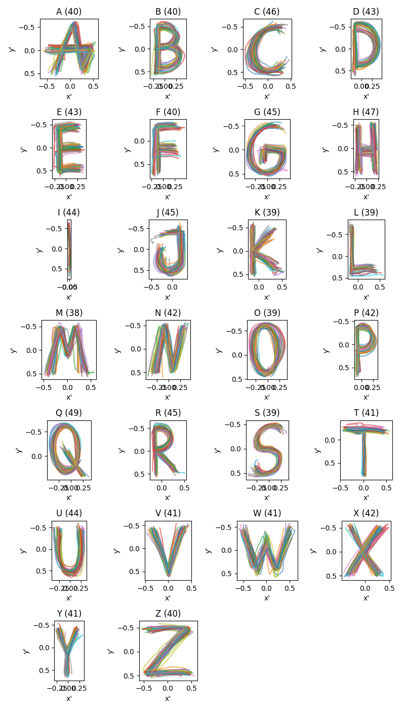

# GestureRecognitionMPT

Ein kleines Projekt zur Gestenerkennung auf Basis von Hand-Landmarks.

Das Projekt demonstriert eine modulare Pipeline zur Erkennung von Gesten aus Webcam-Daten. Dafür werden Hand-Landmarks extrahiert und anschließend mit einem Hidden-Markov-Modell (HMM) klassifiziert.

## Pipeline

Die Verarbeitung erfolgt über mehrere Module:
```
Webcam → HandDetector → Preprocessor → HMMModule
```
- **HandDetector**
  Erkennt Hände im Kamerabild und extrahiert deren Landmarken.

- **Preprocessor**
  Sammelt und normalisiert Fingertrajektorien über mehrere Frames.

- **HMMModule**
  Klassifiziert Gesten mithilfe eines trainierten Hidden-Markov-Modells.

- **TrailMarker**
  Optionales Modul zur Visualisierung der Fingerbewegung.


