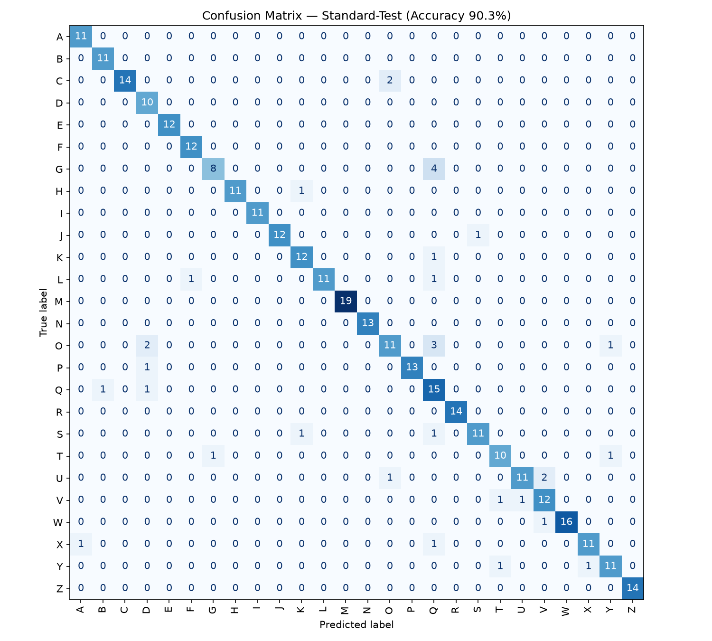

# Ergebnisse: Wie gut erkennt das Modell die Gesten?

Diese Seite fasst zusammen, **wie gut unser trainiertes Modell die
Buchstaben-Gesten (A–Z) erkennt**. Sie richtet sich bewusst an Einsteiger:
jeder Fachbegriff wird kurz erklärt.

Alle Zahlen stammen aus der Funktion
[`evaluate_classifier()`](../GestureRecognition/visualization.py) und wurden auf
unserem eigenen Datensatz gemessen (26 Klassen A–Z, Aufnahmen von 4 Personen).

> **Messlauf:** 2026-07-14, nach gemeinsamer Segmentierung und striktem
> Personen-Hold-out. Konfiguration:
> ein GaussianHMM pro Klasse, `n_components=10`, `covariance_type="diag"`, `min_covar=0.03`,
> `test_size=0.2`, `random_state=42`. Gemessen auf den **26 A–Z-Klassen**; die
> Demo-Geste `recordings/Dreieck` ist ausgeklammert (nicht Teil des Alphabets) und
> ändert die Zahlen praktisch nicht. Reproduktion: siehe
> [Abschnitt 5](#5-ergebnisse-selbst-reproduzieren).

---

## 1. Was messen wir überhaupt? (Accuracy)

**Accuracy** (deutsch: Genauigkeit) ist einfach der Anteil der richtig
erkannten Gesten:

```
Accuracy = richtig erkannte Gesten / alle getesteten Gesten
```

Beispiel: Wenn das Modell von 100 Gesten 90 richtig errät, ist die
Accuracy = 90 %.

Wir berechnen **zwei** verschiedene Accuracy-Werte, weil sie zwei
unterschiedliche Fragen beantworten. Das ist der wichtigste Punkt dieser Seite.

### a) Standard-Accuracy — „kenne ich diese Person schon?"

Hier trainieren und testen wir mit **denselben Personen**, nur mit
unterschiedlichen Aufnahmen. Das Modell hat also von jeder Person schon Beispiele
gesehen.

> **Ergebnis: 92 % richtig** (327 von 357 Test-Gesten, trainiert auf 1428;
> `n_components=10`).

Das ist die *optimistische* Zahl.

### b) Neue-Person-Accuracy — „was, wenn eine völlig fremde Person kommt?"

Hier halten wir **eine ganze Person komplett aus dem Training heraus** und testen
das Modell nur an dieser Person. Das Modell hat diese Hand also **noch nie
gesehen** – genau wie in der Prüfung, wenn der Prüfer live neue Gesten aufnimmt.
Aufnahmen ohne Personen-Tag werden aus dem Hold-out-Training ausgeschlossen,
weil ihre Herkunft nicht sicher belegt werden kann.
Wir machen das der Reihe nach für **alle vier Personen**:

| Zurückgehaltene Person | Getestete Gesten | Neue-Person-Accuracy |
|---|---:|---:|
| wayan  | 440 | **87 %** |
| arian  | 316 | **74 %** |
| yannik | 436 | **62 %** |
| Azad   | 333 | **70 %** |
| **Mittel über alle 4** | | **73 %** |

> **Ergebnis: im Mittel 73 %** (Minimum 62 % bei yannik, Maximum 87 % bei wayan).

Das ist die *ehrliche* Zahl für die Prüfungssituation — **außer** die neue
Person nimmt vorher ein paar eigene Aufnahmen auf und trainiert mit
(`schnell_aufnahme.py` + `python train.py`). Dann gilt die Standard-Zahl.

### c) Live-End-to-End — „läuft die ganze Kette mit der Webcam?"

Die beiden Zahlen oben messen nur den **Klassifikator** auf gespeicherten
Aufnahmen. Der Live-Modus hängt zusätzlich von Handerkennung und Segmentierung ab.
Dieser Pfad ist getrennt abgesichert:

- **Automatisch (bekannte Person):** [`tests/test_end_to_end.py`](../tests/test_end_to_end.py)
  spielt echte Aufnahmen durch die komplette Live-Pipeline
  (Detektor → Preprocessor → HMM) und prüft die Erkennung — läuft in CI.
  Die Testperson steckt auch im Training: das ist ein Pipeline-/Regressionstest,
  kein Generalisierungs-Nachweis.
- **Automatisch (unbekannte Person, Issue #61):**
  [`tests/test_end_to_end_unknown_person.py`](../tests/test_end_to_end_unknown_person.py)
  trainiert ein Modell **ohne** die Testperson wayan (Aufnahmen ohne Personen-Tag
  fliegen ebenfalls raus, weil nicht beweisbar ist, von wem sie stammen) und
  schickt wayans Aufnahmen durch dieselbe Live-Pipeline. Bewertet wird das
  tatsächlich **angezeigte** Label inklusive der `?`-Logik. Messlauf 2026-07-14:
  **79,5 %** korrekt angezeigt (62/78), **11,5 %** als `?`, Rest Verwechslungen
  (häufigste: Q→O). Die Testschwellen (≥ 65 % Accuracy, ≤ 30 % `?`) sind aus
  dieser gemessenen Baseline abgeleitet.
- **Echte Webcam:** ein dokumentierter Durchlauf (neue Geste live aufnehmen →
  trainieren → live erkennen), Protokoll in
  [`webcam-e2e-protokoll.md`](webcam-e2e-protokoll.md).

### Warum ist die zweite Zahl so viel schlechter?

Weil **jeder Mensch einen Buchstaben etwas anders in die Luft malt** – andere
Größe, andere Geschwindigkeit, andere Richtung. Solange das Modell eine Person
schon kennt, ist das kein Problem. Bei einer völlig neuen Person muss es aber von
den bekannten Personen auf die neue *verallgemeinern* – und das fällt schwer.

**Wichtigste Erkenntnis:** Mehr **verschiedene Personen** im Training würden die
Neue-Person-Genauigkeit am stärksten verbessern – deutlich mehr als ein
komplizierteres Modell.

---

## 2. Die Confusion Matrix (Verwechslungs-Tabelle)

Eine **Confusion Matrix** zeigt nicht nur *ob*, sondern *welche* Buchstaben das
Modell verwechselt.



**So liest man die Tabelle:**

- Jede **Zeile** = der Buchstabe, der wirklich gemacht wurde (*True label*).
- Jede **Spalte** = der Buchstabe, den das Modell geraten hat (*Predicted label*).
- Die **Diagonale von links oben nach rechts unten** = alles richtig erkannt.
  Je dunkler die Diagonale, desto besser.
- Jede Zahl **neben** der Diagonale ist eine **Verwechslung**.

Beispiel: In der Zeile „O" steht eine „3" in der Spalte „G". Das heißt:
**3-mal wurde ein „O" gemacht, aber das Modell hat „G" erkannt.**

---

## 3. Was verwechselt das Modell am häufigsten?

Aus der Matrix abgelesen (wahr → vom Modell geraten):

| Verwechslung | Anzahl | Mögliche Erklärung |
|---|---|---|
| O → G | 3× | Beide runde, fast geschlossene Bewegung |
| Z → C, Y → T, G → Q, P → T | je 2× | ähnlicher Verlauf oder Endpunkt |
| E → G, L → F, S → O | je 1× | Einzelfälle |

Die Verwechslungen betreffen vor allem **runde bzw. ähnlich verlaufende
Buchstaben** (O/G/Q, C/Z) – ein Zeichen, dass das Modell nach der Form der
Bewegung unterscheidet und nicht zufällig rät. Seit Training und Live dieselbe
Segmentierung benutzen (#58, nur noch die eigentliche Geste ohne Anfahrt), fällt
vor allem **O** schwerer als vorher – die knappere Spur macht O und G ähnlicher.

---

## 4. Welche Buchstaben laufen gut, welche schlecht?

**Perfekt erkannt (100 %):** A, B, D, F, I, M, N, Q, R, T, V
**Gut (85–95 %):** E, H, J, K, L, P, S, U, W, X, Z
**Schwächer (< 85 %):** C (82 %), Y (79 %), G (75 %), O (56 %)
**Schwächster Buchstabe:** O (56 %, wird am ehesten mit G verwechselt)

Wer das Modell weiter verbessern will, sollte also vor allem **für O (und die
runden Nachbarn G, Q) mehr und deutlich unterscheidbare Aufnahmen** sammeln.

---

## 5. Ergebnisse selbst reproduzieren

Die Zahlen und das Bild lassen sich jederzeit neu erzeugen. Im Projekt-`.venv`
(dort ist `hmmlearn` installiert):

```python
# evaluate_classifier trainiert das Modell frisch, testet es und speichert die
# Confusion-Matrix als PNG. Wir messen die Neue-Person-Zahl fuer alle 4 Personen
# und klammern die Demo-Geste recordings/Dreieck aus (nur die 26 A-Z-Klassen).
import os, tempfile
from pathlib import Path
from GestureRecognition.visualization import evaluate_classifier

farm = Path(tempfile.mkdtemp()) / "recordings"
farm.mkdir(parents=True)
for d in sorted(Path("recordings").iterdir()):
    if d.is_dir() and len(d.name) == 1:        # nur A..Z (schliesst 'Dreieck' aus)
        os.symlink(d.resolve(), farm / d.name)

for person in ["yannik", "wayan", "arian", "Azad"]:
    r = evaluate_classifier(
        recordings_dir=farm,
        output_dir="docs/source/_static",     # hier wird confusion_matrix.png gespeichert
        held_out_person=person,                # diese Person wird komplett rausgehalten
    )
    print(person, round(r["accuracy_new_person"], 3), round(r["accuracy_standard"], 3))
# yannik 0.622 0.916 | wayan 0.866 0.916 | arian 0.737 0.916 | Azad 0.697 0.916
```

Die drei Demo-GIFs im README entstehen übrigens genauso reproduzierbar:

```bash
python demo_gif.py            # nutzt data/hmm.pkl, schreibt images/demo_*.gif
```

> **Hinweis:** Das Training eines HMM enthält kleine Zufallsanteile. Die Werte
> können sich daher von Lauf zu Lauf um ein paar Prozentpunkte unterscheiden – die
> hier gezeigten Zahlen sind das Ergebnis eines repräsentativen Laufs.

---

## 6. Kurzfazit

- Bekannte Personen werden zuverlässig erkannt (**92 %**, 11 von 26
  Buchstaben sogar fehlerfrei).
- Eine völlig neue Person ist deutlich schwerer (**im Mittel 73 %**, je nach
  Person 62–87 %) – das ist die ehrliche Erwartung, wenn jemand ohne eigene
  Trainingsdaten loslegt. Mit ein paar eigenen Aufnahmen + `python train.py` gilt
  die 92-%-Zahl.
- Verwechselt werden vor allem **runde/ähnlich verlaufende Buchstaben** (O/G/Q,
  C/Z) – das Modell arbeitet also plausibel.
- Größte Hebel waren: **Resampling auf feste Gestenlänge**, **min_covar**
  gegen den HMM-Kollaps und **mehr verschiedene Personen** im Training
  (siehe [design-entscheidungen.md](design-entscheidungen.md)).
